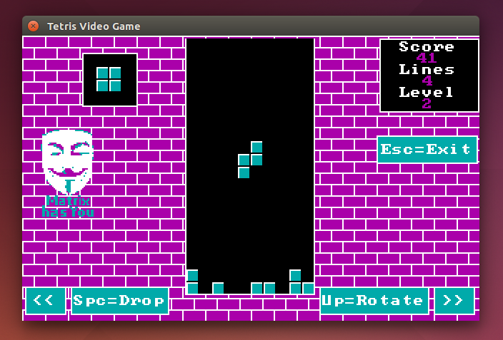

# CGA / VGA-graphic game framework for Java

Do You remember old MS-DOS games? You can write Your own game in modern language - Java! This is Java framework for development desktop games in CGA/VGA-style graphic with 320*200 resolution.

Framework work via Swing and support:

* Transparent upscale to actual desktop resolution.
* PCX file decoding (1 bitplane, 8 bit per pixel - used in GIMP)
* Sprites
* Bitmap 8x8 fonts
* Both CGA palette
* Palette size is up to 256 colors - VGA 320x200x256 is possible.
* Good perfomance - sample game work on slow ARM without delay (like Pocket C.H.I.P)

## Examples

I had implement one example - Tetris game in CGA-style. Please, check https://github.com/vaclav2016/JCGA-Tetris

## Build

You need Maven to build:

    $ mvn install

## Licensing

Code is licensed under the Boost License, Version 1.0. See each
repository's licensing information for details and exceptions.

http://www.boost.org/LICENSE_1_0.txt
